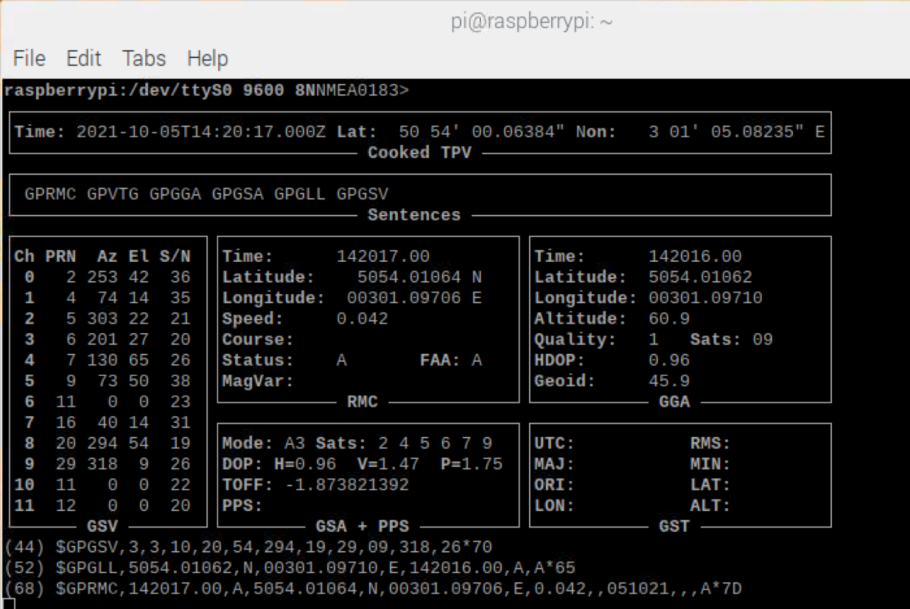

Pi4J V2 :: Java I/O Library for Raspberry Pi :: Serial example application
===========================================================================

GitHub Actions:


This project contains a minimal example application which uses the Pi4J (V2) library to communicate with a device overal
a serial link. Full description is available
on [the Pi4J website](https://v2.pi4j.com/getting-started/minimal-example-application)

## PROJECT OVERVIEW

The goal of the example project is to show how to set up a Pi4J Maven project for the Raspberry Pi.

## WIRING

### TEST IN TERMINAL

```
$ sudo apt-get install gpsd gpsd-clients
$ sudo service gpsd start
$ sudo systemctl status gpsd.socket
● gpsd.socket - GPS (Global Positioning System) Daemon Sockets
   Loaded: loaded (/lib/systemd/system/gpsd.socket; enabled; vendor preset: enabled)
   Active: active (running) since Tue 2021-10-05 16:03:17 CEST; 1min 37s ago
   Listen: /var/run/gpsd.sock (Stream)
           [::1]:2947 (Stream)
           127.0.0.1:2947 (Stream)
    Tasks: 0 (limit: 4915)
   CGroup: /system.slice/gpsd.socket

Oct 05 16:03:17 raspberrypi systemd[1]: Listening on GPS (Global Positioning System) Daemon Sockets.
$ gpsmon /dev/ttyS0
```

It can take a while before you receive signal from enough satellites!



### Running the application on Raspberry Pi

```
$ git clone https://github.com/Pi4J/pi4j-example-serial.git
$ cd https://github.com/Pi4J/pi4j-example-serial.git
$ mvn package
$ cd target/distribution
$ sudo ./run.sh

[main] INFO com.pi4j.util.Console - ************************************************************
[main] INFO com.pi4j.util.Console - ************************************************************
[main] INFO com.pi4j.util.Console - 
[main] INFO com.pi4j.util.Console -                   <-- The Pi4J Project -->                  
[main] INFO com.pi4j.util.Console -                    Serial Example project                   
[main] INFO com.pi4j.util.Console - 
[main] INFO com.pi4j.util.Console - ************************************************************
[main] INFO com.pi4j.util.Console - ************************************************************
[main] INFO com.pi4j.util.Console - 
[main] INFO com.pi4j.Pi4J - New auto context
[main] INFO com.pi4j.Pi4J - New context builder
[main] INFO com.pi4j.platform.impl.DefaultRuntimePlatforms - adding platform to managed platform map [id=raspberrypi; name=RaspberryPi Platform; priority=5; class=com.pi4j.plugin.raspberrypi.platform.RaspberryPiPlatform]
...
[main] INFO com.pi4j.util.Console - Waiting till serial port is open
[main] INFO com.pi4j.util.Console - 
[main] INFO com.pi4j.util.Console - Serial port is open
...
[SerialReader] INFO com.pi4j.util.Console - Data: '$GPRMC,,V,,,,,,,,,,N*53'
[SerialReader] INFO com.pi4j.util.Console - Data: '$GPVTG,,,,,,,,,N*30'
[SerialReader] INFO com.pi4j.util.Console - Data: '$GPGGA,,,,,,0,00,99.99,,,,,,*48'
[SerialReader] INFO com.pi4j.util.Console - Data: '$GPGSA,A,1,,,,,,,,,,,,,99.99,99.99,99.99*30'
[SerialReader] INFO com.pi4j.util.Console - Data: '$GPGSV,1,1,01,20,,,28*70'
[SerialReader] INFO com.pi4j.util.Console - Data: '$GPGLL,,,,,,V,N*64'
[SerialReader] INFO com.pi4j.util.Console - Data: '$GPRMC,,V,,,,,,,,,,N*53'
[SerialReader] INFO com.pi4j.util.Console - Data: '$GPVTG,,,,,,,,,N*30'
[SerialReader] INFO com.pi4j.util.Console - Data: '$GPGGA,,,,,,0,00,99.99,,,,,,*48'
[SerialReader] INFO com.pi4j.util.Console - Data: '$GPGSA,A,1,,,,,,,,,,,,,99.99,99.99,99.99*30'
```

## RUNTIME DEPENDENCIES

This project uses Pi4J V.2 which has the following runtime dependency requirements:

- [**SLF4J (API)**](https://www.slf4j.org/)
- [**SLF4J-SIMPLE**](https://www.slf4j.org/)
- [**PIGPIO Library**](http://abyz.me.uk/rpi/pigpio) (for the Raspberry Pi) - This dependency comes pre-installed on
  recent Raspbian images. However, you can also download and install it yourself using the instructions found
  [here](http://abyz.me.uk/rpi/pigpio/download.html).

## BUILD DEPENDENCIES & INSTRUCTIONS

This project can be built with [Apache Maven](https://maven.apache.org/) 3.6
(or later) and Java 11 OpenJDK (or later). These prerequisites must be installed prior to building this project. The
following command can be used to download all project dependencies and compile the Java module. You can build this
project directly on a Raspberry Pi with Java 11+.

```
mvn clean package
```

### Compiled application to run on the Raspberry Pi

Once the build is complete and was successful, you can find the compiled artifacts in the `target` (Maven) or `build` (
Gradle) folder. Specifically all dependency modules (JARs) and a simple `run.sh` bash script will be located in the
`target/distribution` (Maven) or `build/distribution` (Gradle) folder.

These are all the required files needed to distribute (copy) to your Raspberry Pi to run this project. If you are using
the native bindings running locally on the Raspberry Pi, then you make have to run the program using `sudo`
to gain the necessary access permissions to the hardware I/O.

This is the list of files created by the build process of this example application:

* pi4j-core
* pi4j-example-serial
* pi4j-library-pigpio
* pi4j-plugin-pigpio
* pi4j-plugin-raspberrypi
* slf4j-api
* slf4j-simple
* run.sh --> this is the actual start file which will run pi4j-example-minimal

Make the run script executable and start it like this:

```
chmod +x run.sh
sudo ./run.sh
```

## LICENSE

Pi4J Version 2.0 and later is licensed under the Apache License, Version 2.0 (the "License"); you may not use this file
except in compliance with the License. You may obtain a copy of the License at:
http://www.apache.org/licenses/LICENSE-2.0

Unless required by applicable law or agreed to in writing, software distributed under the License is distributed on an "
AS IS" BASIS, WITHOUT WARRANTIES OR CONDITIONS OF ANY KIND, either express or implied. See the License for the specific
language governing permissions and limitations under the License.

